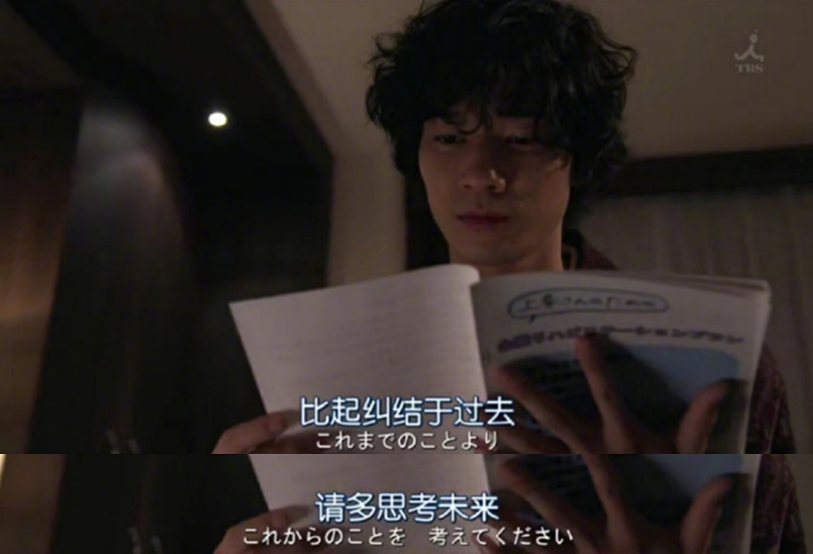
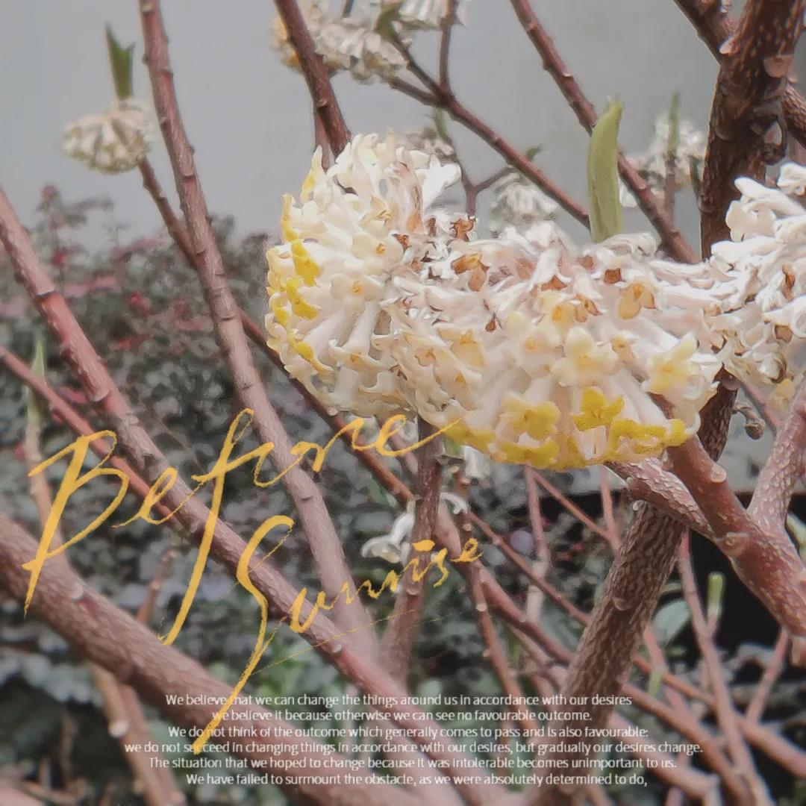

# Blog 计划 | Hello World

## 最近还好吗？

### #HERstory

_睡衣_
  

> 雨停时分，洗澈烟尘
>
> 新的花梗，正期待炫耀颜色

  

  

你好

感谢你来这里转转

如果你愿意与我聊两句的话

我有茶，也有酒

或者

只是歇歇脚

我们相顾无言

其实也很不错

 

现在是2021年3月20日

凌晨一点四十

春分

春雷乍响

长风沛雨

比起去年

一个好的开端

 

我想

是时候了

在这个春天

重启

做回我自己

 

春天来了

你也来了

那美好的东西

也会纷至沓来吧

 

楼下的春天

作为见面礼

