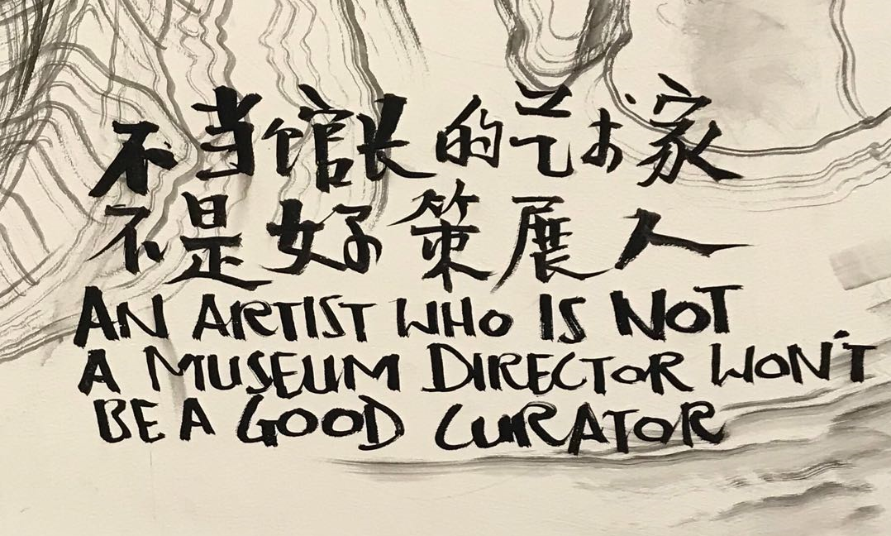

# Blog 计划 | 关于我的成长故事

## 迈出第一步弥足珍贵

### #HERstory

_睡衣_

 

时间关系，没有办法在规定时间内写一篇相当切题的正经文章。所以还是想说一些关于自己的故事。

 

我是一个美术史专业研究生，97年，射手座，生于江南。在过去的24年里，我有一大半的时间都活成了我家长最喜欢的女孩子样：听话、懂事、成绩优异、安静内敛，感谢我爸妈，还给了我一张不错的脸。

 

在我还是一个读幼儿园的小不点时，我就有了清晰的性别概念。不知道为什么，那个时候的我就觉得，女孩子就是要穿漂漂亮亮的裙子，而酷酷的衣服裤子，让人看起来像“假小子”。记得前几年整理衣柜的时候，我翻出一套儿时令我记忆深刻的衣服，黑白条纹上衣，黑色垮裤，看起来很酷，是如今美术生的“标配”All Black（开玩笑，这也是一个相当离谱的标签），我清楚地记得当时我妈很喜欢让我穿这身衣服，虽然我乖乖地穿上了，但内心却是嫌弃无比，因为这让我看起来像个男孩子。当时的我，喜欢穿转起圈来会像花朵一样散开的裙子。

 

如今回想起来，觉得颇有点好笑，又有点迷茫。原来性别意识和固有印象在那么小的时候就已深刻印在我们的脑海中！

 

成长的过程，是生理上的变化，也是心理上的重塑。十几年来，我学生时代最重要的事，除了学习，就是不断更新两性知识。感谢时代，让我有足够多的机会从那些已成定式的观念中跳脱出来，听到其它声音。原来女生可以帅气，男生也可以柔美；原来女性也可以在政坛叱咤风云，原来男性也可以做家庭煮夫；原来当今社会还有那么多对女性的偏见与刻板印象，原来也还有那么多和我一样对此抱有怀疑的人。

 

虽然，在学习上，我还是成为了那个加深“刻板印象”的一份子，但是在我的同学中，也看到了很多颠覆的例子。在33分的物理成绩让我彻底对理科敬而远之后，内心其实还是有一些遗憾，在我对自己的评估里，我的动手能力一向非常强，我享受拼装的乐趣，我的空间能力也很不错，立体几何是我学得最好的数学知识点，在职业规划测试中，最适合我的职业竟然是火箭制造，或许这些我从未对人提起过，甚至自己也曾像对待一个玩笑一样一笑了之，然后重新投入大段的文史知识，但是现在的我清楚地知道，对工程师的向往并不只是小时候觉得这个职业听起来很高端，而是我曾有天赋，却被自己藏了起来。当然，在文科学习中，我也取得了不错的成绩，用别人的话来说，我还挺擅长学习。

 

后来，考大学那会，我还做过建筑师的梦，又因为为时已晚而已文化生的身份进入了美术学院。在本科期间我经历了人生中第二次严重的身份认同危机，因为在一个艺术生聚集的学校，文化生的身份无可避免地被边缘化。不过，随后我立即发现，并不是所有考进这所学校的艺术生都像刻板印象中的那样很会画画，或是创造力丰富，毕竟，艺术是真正需要天赋的一项活动，能成为艺术家的少之又少，而能被称为天才的，更是百年一遇。

 

但是进入艺术学院有一个好处，这里开放、自由，再奇怪的行为也只会被说一句个性。我的同学们都有很前卫的思想，他们为平权创作，为LGBTQ发声，为失望的社会事实痛心疾首。在这里，曾经被我深藏（偶尔也会放出来）的叛逆终于被释放，射手座的基因也开始作祟。我在这里重新认识了我自己，大方承认了我自己，喜欢变化、喜欢旅行、喜欢微醺、在熟人面前咋咋呼呼、在陌生的环境立刻自闭的我，一个永远不安分的我。

 

所以，你现在看到的，是我的不安分人格。在这里，我要为我曾经放弃的另一个方向重新迈出第一步，不论那时是因为真的资质所限，还是被刻板印象无形影响。

 

冒险精神，就是女性需要的力量。当然，也是所有人冲破刻板印象的力量，因为最近看青春有你3，爱上了那些拥有坚定内心的优秀小孩。

 

你不是怪胎，也不是平庸，你是独一无二。

 

共勉。

 

